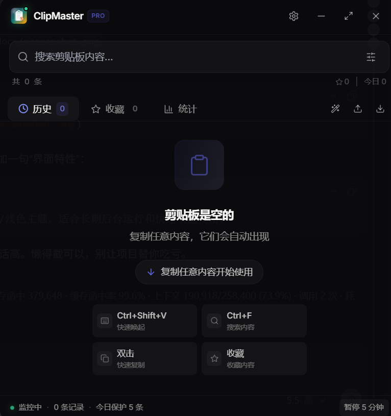

<p align="center">
  
</p>

<h1 align="center">ClipMaster</h1>

<p align="center">
  <strong>A local-first clipboard manager for Windows</strong>
</p>

<p align="center">
  Save, search, favorite, and manage clipboard history. Your data stays on your machine.
</p>

<p align="center">
  <a href="https://github.com/dhadb/ClipMaster/releases/latest"><strong>Download for Windows</strong></a>
  ·
  <a href="README.md">中文</a>
  ·
  <a href="PRIVACY.md">Privacy</a>
  ·
  <a href="SECURITY.md">Security</a>
</p>

<p align="center">
  
  
  
  
  
</p>

<p align="center">
  
</p>

## Why ClipMaster

- **Local-first**: Clipboard history, settings, and image cache are stored only under `%AppData%/ClipMaster/`.
- **Fast recovery**: Search and filter copied text, links, code snippets, colors, JSON, Markdown, and images.
- **Privacy guardrails**: High-risk content such as passwords, tokens, private keys, and card numbers is skipped by default.
- **Keyboard friendly**: Open the app globally with `Ctrl + Shift + V`, then search, select, and copy quickly.

## Quick Start

1. Open [Releases](https://github.com/dhadb/ClipMaster/releases/latest).
2. Download `ClipMaster Setup 1.0.0.exe`.
3. Run the installer.
4. Copy anything and press `Ctrl + Shift + V` to open ClipMaster.

## Verify the Installer

Release assets include `checksums.sha256`. After downloading the installer, verify it in PowerShell:

```powershell
Get-FileHash -Algorithm SHA256 ".\ClipMaster Setup 1.0.0.exe"
```

Compare the SHA256 output with `checksums.sha256`. If it does not match, do not run the installer and report it in [Issues](https://github.com/dhadb/ClipMaster/issues).

Windows may show a SmartScreen warning for unsigned open-source installers. Download ClipMaster only from this repository's GitHub Releases.

## Features

| Feature | Description |
| --- | --- |
| Live monitoring | Captures clipboard changes automatically |
| History | Stores up to 500 clipboard entries |
| Smart categories | Detects text, links, emails, code, colors, JSON, Markdown, images, and more |
| Search | Fuzzy search with type filters |
| Favorites | Pin important clipboard items |
| Stats | View type distribution and usage patterns |
| Export | Export history as JSON |
| Local privacy | No upload, sync, or clipboard analytics |

## Shortcuts

| Shortcut | Action | Scope |
| --- | --- | --- |
| `Ctrl + Shift + V` | Show / hide window | Global |
| `Ctrl + F` | Focus search | In app |
| `↑` / `↓` | Move selection | In app |
| `Enter` | Copy selected item | In app |
| `Delete` | Delete selected item | In app |
| `Esc` | Clear search / close | In app |

## Development

```bash
git clone https://github.com/dhadb/ClipMaster.git
cd ClipMaster
npm install
npm run dev
```

Build the Windows installer:

```bash
npm run build -- --publish never
```

## License

[MIT](LICENSE)
