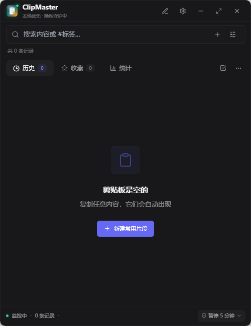

<p align="center">
  
</p>

<h1 align="center">ClipMaster</h1>

<p align="center">
  <strong>A local-first clipboard manager for Windows</strong>
</p>

<p align="center">
  Save, search, favorite, and manage clipboard history. Your data stays on your machine.
</p>

<p align="center">
  <a href="https://github.com/dhadb/ClipMaster/releases/latest"><strong>Download for Windows</strong></a>
  ·
  <a href="README.md">中文</a>
  ·
  <a href="PRIVACY.md">Privacy</a>
  ·
  <a href="SECURITY.md">Security</a>
</p>

<p align="center">
  
  
  
  
  
</p>

<p align="center">
  
</p>

## Why ClipMaster

- **Local-first**: Clipboard history, settings, and image cache are stored only under `%AppData%/ClipMaster/`.
- **Fast recovery**: Fuzzy, pinyin, tag, type, and workspace search finds copied text, links, code snippets, colors, JSON, Markdown, and images.
- **Privacy guardrails**: High-risk content such as passwords, tokens, private keys, and card numbers is skipped by default.
- **Quick paste**: Press `Ctrl + Shift + V`, choose an entry with the arrow keys, then press `Enter` to return to the previous Windows app and paste it automatically.
- **Efficient workflows**: Combine time, type, and sort filters, then batch favorite, pin, tag, or delete records.

## Quick Start

1. Open [Releases](https://github.com/dhadb/ClipMaster/releases/latest).
2. Download `ClipMaster-Setup-2.1.1.exe`, or choose `ClipMaster-Portable-2.1.1.exe`.
3. Run the installer, or launch the portable build directly.
4. Copy anything, press `Ctrl + Shift + V`, select an entry with the arrow keys, and press `Enter` to paste it back into the previous app.

## Verify the Installer

Release assets include `checksums.sha256`. After downloading the installer, verify it in PowerShell:

```powershell
Get-FileHash -Algorithm SHA256 ".\ClipMaster-Setup-2.1.1.exe"
```

Compare the SHA256 output with `checksums.sha256`. If it does not match, do not run the installer and report it in [Issues](https://github.com/dhadb/ClipMaster/issues).

Windows may show a SmartScreen warning for unsigned open-source installers. Download ClipMaster only from this repository's GitHub Releases.

### In-app updates

Starting with `v1.4.1`, ClipMaster can download the official Windows installer inside the app after finding a new release, show live progress, and install it with a restart. Starting with `v2.1.0`, the settings page also displays the GitHub Release notes for the detected version. If the download fails, the Release page remains available as a fallback.

`v1.5.0` adds Electron `safeStorage` encryption for local history and settings, separate global shortcuts for showing history, focusing search, and clearing unprotected records, plus compact JPEG thumbnails with bounded renderer cache usage.

`v1.6.0` adds Windows quick paste, offline fuzzy and pinyin search with highlights, recent searches and encrypted saved filters, copy timelines, automatic foreground-app workspaces with manual workspace labels, richer content actions, and clearer privacy pause states. Quick paste, pinyin lookup, and workspace detection run locally; clipboard content is never uploaded.

`v1.7.0` makes quick paste deterministic: it records the foreground window handle (HWND) when opened, then restores and pastes only into that target when you press `Enter`. If the target cannot be confirmed, the item remains copied without a blind paste. Foreground app and workspace detection now use an asynchronous cache to keep high-frequency captures responsive, and "Pause for this app" correctly uses the app active before ClipMaster opened. The last five searches now persist through encrypted settings, and English terminology now correctly labels saved items as Favorites.

`v2.0.0` establishes the security and reliability foundation: the renderer runs with sandboxing and a content security policy, sensitive IPC calls accept only trusted renderer requests, persisted data is versioned with a last-known-good backup, HTML/RTF and source applications are retained, and in-app installers must pass release checksum verification before installation.

## Features

| Feature | Description |
| --- | --- |
| Live monitoring | Captures clipboard changes automatically |
| Multi-format clipboard | Preserves text, HTML, RTF, and Windows file lists; each saved file can be revealed in Explorer |
| History | Stores up to 5000 clipboard entries with a reusable search index and bounded query cache |
| Smart categories | Detects text, links, emails, code, colors, JSON, Markdown, images, file lists, and more |
| Command-style search | Fuzzy matches such as `git pu`, offline pinyin search, highlights, recent searches, saved filters, plus `#tags`, `type:`, `workspace:`, `app:`, `is:pinned`, `has:files`, and `has:rich` queries |
| Reusable snippets | Save frequently used text, commands, and replies manually |
| Tags | Organize any entry with tags preserved across import and export |
| Favorites | Use pinning for immediate access; keep longer-lived replies, commands, and addresses in Favorites, then organize them with tags |
| Smart collections | Save a combined search, type, time, and sort view; result counts update as history changes |
| Workspaces | Automatically label captures by the foreground Windows app; add a manual workspace such as Project A, thesis, or travel in details |
| Batch actions | Pin, favorite, tag, or delete multiple selected records |
| Content editing | Edit snippet content and tags in details with automatic type detection |
| Smart content actions | Open or clean tracking parameters from links, format or compact JSON, copy HEX/RGB colors, and normalize code line endings |
| Copy timeline | Review recent times an item was copied without duplicating it in the list |
| Delete undo | Restore recently deleted records before the notification expires |
| Stats | View type distribution and usage patterns |
| Personalized appearance | Eight themes, five independent accents, density, type size, opacity, and window size |
| Update checks | Check GitHub Releases at startup or manually, then download, install, and restart in the app |
| Data security | Encrypt local persistence with Electron `safeStorage` while migrating older plaintext data safely |
| Global shortcuts | Configure separate shortcuts for showing history, focusing search, and clearing unprotected records |
| Image performance | Store 256px JPEG thumbnails, bound renderer cache usage, and clean unreferenced image files |
| Import and export | Export text-only JSON metadata without images or local file-list records, then merge or replace history during import |
| Local privacy | No upload, sync, or clipboard analytics; block selected applications so their text, images, and file lists never enter history |
| Privacy controls | Toggle credential, payment-card, and identity-number detection separately; shows only how many items were skipped and supports timed, manual, or current-app monitoring pauses |

## Shortcuts

| Shortcut | Action | Scope |
| --- | --- | --- |
| `Ctrl + Shift + V` | Open the quick-paste panel | Global |
| `Ctrl + Shift + F` | Show window and focus search | Global |
| `Ctrl + Shift + Delete` | Clear unpinned, unfavorited records | Global |
| `Ctrl + F` | Focus search | In app |
| `Ctrl + N` | Create a reusable snippet | In app |
| `↑` / `↓` | Move selection | In app |
| `Enter` | Paste selected item back into the previous Windows app | In app |
| `Delete` | Delete selected item | In app |
| `Esc` | Clear search / close | In app |

## Roadmap

- [x] Ship the `v2.0.0` security and reliability foundation
- [x] Add HTML, RTF, and file-list clipboard support in `v2.1.0`
- [x] Add indexed search for 5000 history entries in `v2.1.0`
- [x] Add application privacy policies, granular privacy toggles, and smart collections in `v2.1.0`
- [x] Support custom shortcuts, portable downloads, and secure update downloads
- [ ] Add Windows Authenticode code signing (certificate setup deferred)

## Development

Requires Node.js 22.12 or newer.

```bash
git clone https://github.com/dhadb/ClipMaster.git
cd ClipMaster
npm install
npm run dev
```

Build the Windows installer:

```bash
npm run build -- --publish never
```

## License

[MIT](LICENSE)
